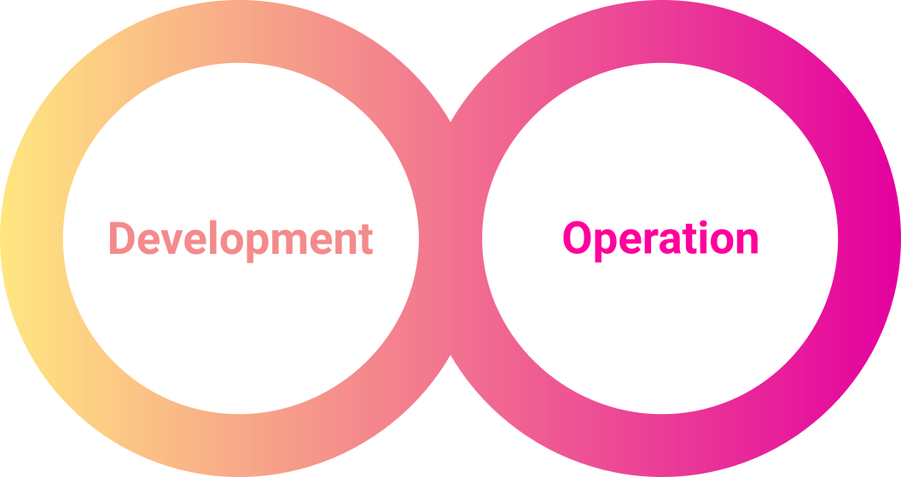
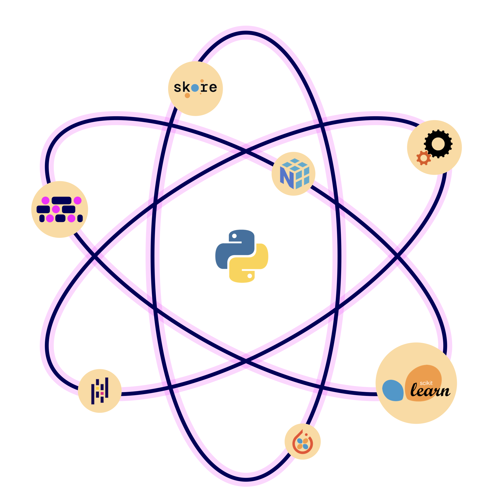

What is chemotools?
====================

**chemotools** is an open‑source Python package for spectral preprocessing and chemometric workflows. It plugs directly into the Python ecosystem (``scikit-learn``, ``numpy``, etc.), enabling flexible, reproducible, and scalable model development.

* **Flexible:** build pipelines that fit your problem.
* **Composable:** works like Lego blocks with scikit-learn pipelines and tools.
* **Scalable:** designed for smooth transitions from prototype to production.

.. note::
   Build exactly what you need, integrate with the tools you trust, and scale without compromise.

Why it matters
--------------
Spectroscopy is diverse — different instruments, sample matrices, and analysis goals demand different approaches. Chemotools gives you control: use only the pieces you need, combine them with open‑source tools, and evolve your workflow as your problem evolves.

How it works
------------
Chemotools transforms preprocessing into a **modular, composable process**: each transformer follows the ``fit`` / ``transform`` API, so you can chain steps seamlessly with scikit-learn pipelines. That means reproducibility, robustness, and scalability from the start.

Quality & Transparency
-----------------------
Chemotools is built not only for flexibility and scalability, but also to make validation and trust easy.

* **Thorough testing** — Chemotools is covered by extensive unit tests and continuous code coverage to ensure reliability and robustness.
* **Transparency** — We proactively provide a Software Bill of Materials (SBOM) in CycloneDX format, making validation and clearance processes straightforward for regulated industries.
* **Peer‑reviewed** — Chemotools has undergone peer review and is published in the *Journal of Open Source Software (JOSS)*.

.. note::
   Quality, transparency, and trust — built in from the start.
