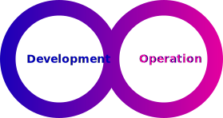

What is chemotools?
===================

This project provides a toolkit for spectral preprocessing techniques integrated with the widely popular
``scikit-learn`` API and the rest of the Python machine learning environment. The goal of the project is to 
provide a comprehensive and user-friendly package to standardize the development and deployment of chemometric models. 
The project intends to enable users to easily build and deploy machine learning and chemometric models on top of 
preprocessed data, making it possible to identify patterns and make predictions with greater accuracy.

