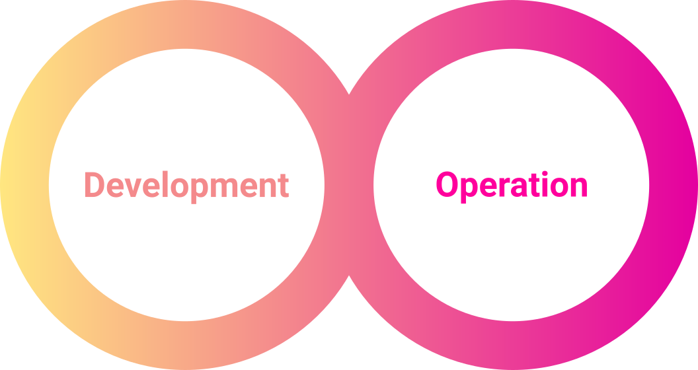

What is chemotools?
===================

Chemometrics focuses on extracting meaningful chemical information from complex data, often involving multivariate analysis and pattern recognition. By combining chemometric workflows with modern machine learning tools like Scikit-Learn, researchers and engineers can enhance traditional approaches with more robust, flexible, and scalable solutions. Scikit-Learn provides a powerful framework for building, validating, and deploying models in a reproducible and efficient way—whether you're analyzing spectroscopic data, optimizing experimental designs, or building predictive models in analytical chemistry.

This project provides a toolkit for spectral preprocessing techniques integrated with the widely popular
``scikit-learn`` API and the rest of the Python machine learning environment. The goal of the project is to 
provide a comprehensive and user-friendly package to standardize the development and deployment of chemometric models. 
The project intends to enable users to easily build and deploy machine learning and chemometric models on top of 
preprocessed data, making it possible to identify patterns and make predictions with greater accuracy.

