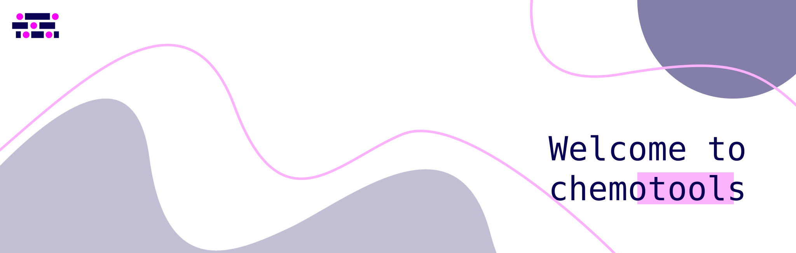

:html_theme.sidebar_secondary.remove:

.. toctree::
   :maxdepth: 1
   :hidden:

   User Guide <_user/index>
   Methods <_methods/index>
   Explore <_explore/index>
   Learn <_learn/index>
   Cite <_cite/index>

.. warning::
   Site under construction! check https://paucablop.github.io/chemotools/ for a full documentation site

chemotools is a Python project that provides a toolkit of algorithms for spectral preprocessing that integrates with the widely popular
``scikit-learn`` API and the rest of the Python machine learning environment. The goal of chemotools is to 
provide a comprehensive and user-friendly environment to standardize the development and deployment of chemometric models. Through chemotools, 
scientists are empowered to build and deploy machine learning and chemometric solutions for their specific use cases.

.. image:: https://img.shields.io/pypi/v/chemotools
   :target: https://pypi.org/project/chemotools
   :alt: PyPI version

.. image:: https://img.shields.io/pypi/pyversions/chemotools
   :target: https://pypi.org/project/chemotools
   :alt: Python versions

.. image:: https://img.shields.io/pypi/l/chemotools
   :target: https://github.com/paucablop/chemotools/blob/main/LICENSE
   :alt: License

.. image:: https://codecov.io/github/paucablop/chemotools/branch/main/graph/badge.svg?token=D7JUJM89LN
   :target: https://codecov.io/github/paucablop/chemotools
   :alt: Code coverage

.. image:: https://static.pepy.tech/badge/chemotools
   :target: https://pepy.tech/project/chemotools
   :alt: Downloads

.. image:: https://joss.theoj.org/papers/10.21105/joss.06802/status.svg
   :target: https://doi.org/10.21105/joss.06802
   :alt: DOI

----

Start exploring
===============

.. grid:: 1 1 3 3
   :gutter: 2 3 4 4

   .. grid-item-card::
      :img-top: ../source/_static/_test_image/explore4.png
      :text-align: center

      .. button-ref:: _explore/index
            :expand:
            :color: secondary
            :click-parent:

            **Start exploring chemotools**

   .. grid-item-card::
      :img-top: https://www.youtube.com/watch?v=leB43KchETw&t=2095s/maxresdefault.jpg
      :text-align: center

      .. button-ref:: _explore/index
            :expand:
            :color: secondary
            :click-parent:

            **Check out our Webinar**

   .. grid-item-card::
      :img-top: ../source/_static/_test_image/learn4.png
      :text-align: center

      .. button-ref:: _learn/index
            :expand:
            :color: secondary
            :click-parent:

            **Learn with chemotools**

